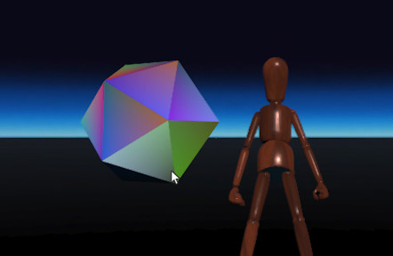

/*

##### placeholder readme

* build plugins/hifiMeshTest against compatible branch (with object-plugin support)
* create a Shape Entity
* set its render plugin to 'plugin://entity::Shape::MeshTest'
* can now use `Graphics.updateModel` and friends to manipulate the in-memory mesh

eg:


```javascript
*/
var SHAPE_PROXY_PLUGIN_URI = 'plugin://entity::Shape::MeshTest';
print('Available render plugins: ', Graphics.getAvailableRenderPlugins());

var shapeEntityID = Entities.addEntity({
    type: 'Shape',
    position: MyAvatar.position,
    dimensions: Vec3.ONE,
    lifetime: 600,
    name: 'test mesh',
}, true); // <-- must be clientOnly right now

Script.scriptEnding.connect(function() {
    Entities.deleteEntity(shapeEntityID);
});

if (!Graphics.setRenderPlugin(shapeEntityID, SHAPE_PROXY_PLUGIN_URI)) {
  throw new Error("could not assign render plugin");
} else {
  print('assigned render plugin:', Graphics.getRenderPlugin(shapeEntityID));
}

// wait a few frames so the render plugin has time to initialize
Script.setTimeout(function() {
    Graphics.getModel(shapeEntityID).updateVertexAttributes(function(a) {
        return {
            color: { x: Math.random(), y: Math.random(), z: Math.random() },
        };
    });
}, 100);

/*
```
*/
